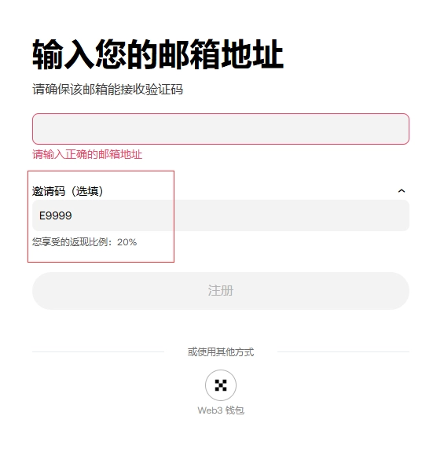

# OKX New User Registration: Get 20% Fee Rebates and Free Bitcoin Mystery Box

Looking for a reliable crypto exchange that actually rewards you from day one? OKX (formerly OKEx) offers new users an immediate 20% trading fee rebate on all transactions—spot and futures—plus a mystery box containing up to $3,000 in digital assets. Whether you're starting your first Bitcoin purchase or scaling up your trading volume, this guide shows you exactly how to maximize your benefits using invitation code **47044926**.

---

## Why OKX Stands Out Among Top-Tier Exchanges

OKX ranks as one of the world's top two cryptocurrency and Web3 platforms, serving global users with seamless trading access to Bitcoin (BTC), Ethereum (ETH), USDT, Shiba Inu (SHIB), Ripple (XRP), Dogecoin (DOGE), and hundreds of other digital assets. The platform handles both spot trading and derivatives, giving you flexible options whether you're holding long-term or actively trading.

What makes OKX particularly appealing? Three things:

**Security you can trust.** Unlike smaller exchanges promising 80% rebates but carrying significant runaway risks, OKX maintains proven infrastructure with billions in daily trading volume. Your principal stays protected.

**Genuine fee savings.** That 20% rebate isn't a promotional gimmick—it's automatically calculated and settled into your account every hour. For active traders, this compounds into serious savings over time.

**Beginner-friendly onboarding.** The mystery box reward gives new users actual crypto to start with, not just theoretical benefits. Complete simple verification tasks, and you're eligible for rewards up to $3,000.

## Registration Benefits Breakdown

Here's what you get when registering through the referral channel:

**1. Lifetime 20% Fee Rebate (Hourly Settlement)**

Every trade you make—spot or futures—automatically returns 20% of your trading fees. These rebates settle every hour, not monthly or quarterly. The rebate applies to both maker and taker fees, covering your entire trading activity.

Even better: if you already have an OKX account, you can register a pure trading account without full identity verification. No extra phone number? Register using email instead.

**2. High-Volume Trader Upgrades**

Trading significant volume? Contact support to discuss custom rebate arrangements. Top traders can negotiate total rebates reaching 30% or higher, depending on monthly trading volume and asset class.

**3. New User Mystery Box**

After registration, claim your mystery box containing cryptocurrency rewards. While amounts vary, boxes can hold up to $3,000 in digital assets. Think of it as your starting capital, courtesy of OKX.

👉 [Claim your 20% lifetime rebate and mystery box with instant registration](https://www.okx.com/join/47044926)

## How to Register and Activate Your Benefits

The process takes under five minutes:

**Step 1:** Click the registration link or visit OKX's signup page directly.

**Step 2:** Enter invitation code **47044926** in the referral code field. This code activates your 20% rebate automatically.

**Step 3:** Complete basic registration using your email or phone number. No immediate identity verification required for trading-only accounts.

**Step 4:** Download the app. Android users can download directly after registration. iOS users need an overseas Apple ID—search tutorials for "how to register overseas Apple ID" or purchase/rent one through platforms like Taobao.

**Step 5:** Complete new user tasks to unlock your mystery box. Tasks typically involve simple actions like making your first deposit or completing a small trade.

## Why Choose OKX Over Other Exchanges?

When comparing major exchanges, three platforms offer the highest rebates: Binance, OKX, and HTX (formerly Huobi). All cap at 20% for standard users.

So why OKX specifically?

**Lower entry barriers.** OKX doesn't require extensive verification for basic trading accounts, making it faster to start trading compared to Binance's stricter KYC requirements.

**Clearer fee structure.** While Binance frequently adjusts fee tiers based on BNB holdings and 30-day volume, OKX's rebate system operates more transparently with hourly settlements you can track in real-time.

**Better support for new traders.** The mystery box system and simplified onboarding process help newcomers start with actual assets, not just empty accounts.

For traders prioritizing capital safety, trading efficiency, and transparent rebates, 👉 [OKX delivers all three without compromise](https://www.okx.com/join/47044926).

## Maximizing Your Rebate Benefits

To get the most from your 20% rebate:

**Track hourly settlements.** Check your rebate balance regularly to understand exactly how much you're saving. This helps refine your trading strategy around fee optimization.

**Consider trading pairs carefully.** Different trading pairs carry different fee structures. Rebates apply to all pairs, but higher-volume pairs compound your savings faster.

**Explore both spot and futures.** Your rebate applies across all trading types. If you're comfortable with leverage, futures trading can multiply both your returns and your rebate accumulation (though it also increases risk).

**Refer others.** OKX's referral program lets you earn additional commissions when friends register using your code. This creates a secondary income stream beyond your personal trading rebates.

## Getting Started Today

The combination of immediate fee rebates, mystery box rewards, and proven platform security makes OKX's current promotion one of the most valuable entry points for new crypto traders. Whether you're making your first Bitcoin purchase or moving from another exchange, the 20% lifetime rebate represents tangible, ongoing savings that compound with every trade.

Registration takes minutes, the invitation code **47044926** activates all benefits automatically, and you'll start seeing rebate settlements within hours of your first trade. For anyone serious about crypto trading in 2025, that's a compelling reason to start with OKX right now: proven security, transparent rebates, and immediate rewards that actually land in your account.
